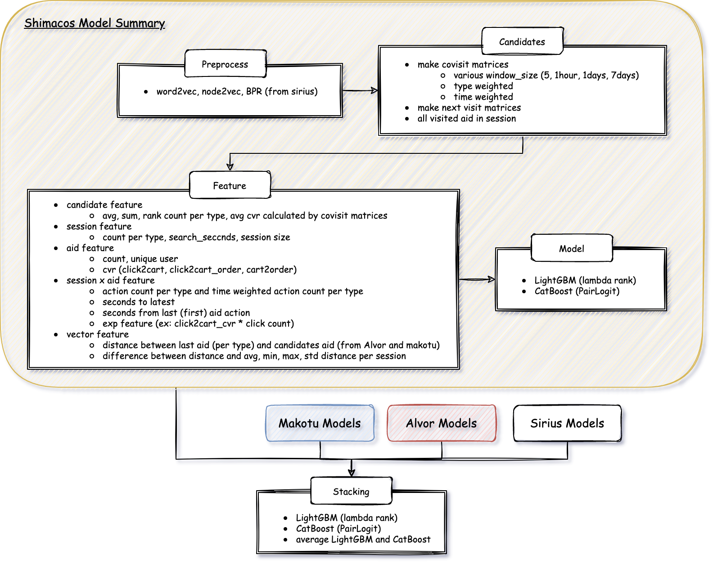

# kaggle-otto-3rd-place-solution

## Summary



## Environment setup

- I used T4 x 4 VM instance with 400GB memory.

- Docker build

```bash
docker-compose build
```

- Set your google cloud project in yamls/sql.yaml and docker-compose.yaml to use BigQuery.

  - In yamls/sql.yaml.

    ```yaml
    env:
      project_id: [your gcp project]
      dataset_id: otto
    ```

  - In docker-compose.yaml.
    ```yaml
    environment:
      - GOOGLE_CLOUD_PROJECT=[your gcp project]
    ```

## Prepare Data

- I used Radek and Chris Dataset. So, I need to download it from kaggle to input directory.

```bash
kaggle datasets download -d cdeotte/otto-validation -p ./input/train --unzip
kaggle datasets download -d radek1/otto-full-optimized-memory-footprint -p ./input/test --unzip
```

- And you will also need results of my teammates. Please copy from their directory.

```bash
cp ../alvor/output/* ./output/alvor
cp ../sirius/output/* ./output/sirius
cp ../makotu/output/* ./output/makotu
```

- Upload to BigQuery

```bash
sh bin/001_upload_datasets.sh
```

## Preprocess

- Train word2vec, node2vec and bpr to use for features and candidates and execute all necessary SQL.
- You can do it all at once with the following command

```bash
sh bin/002_preprocess.sh
```

## Train my models

- Train lightgbm models.

```bash
sh bin/003_train_models.sh
```

## Train stacking models

- Prepare dataset of stacking and train lightgbm model and catboost model.

```bash
sh bin/004_train_stacking_models.sh
```

## Blending

- Finally, rank blend predictions of stacking.
- `./output/blending/v16.csv` is the final submission.

```bash
sh bin/005_blending.sh
```
